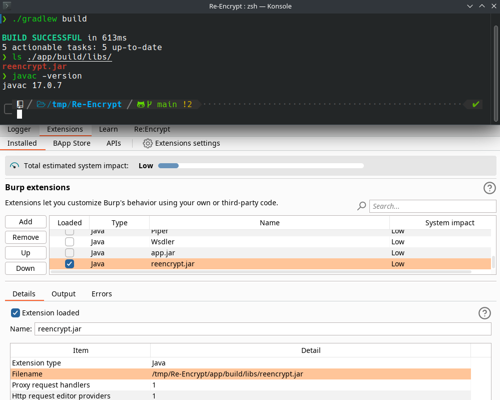

# Re:Encrypt

This burp extension allows you to send parts of the requests to command-line tools and replace these parts by the tools' outputs. The main use case is for testing apps with an extra encryption layer over HTTP. 

So, re:encode or re:encrypt them!

Burp Suite v2023.7 or later is recommended to avoid bugs[[1](https://github.com/morkin1792/Re-Encrypt/blob/af913a1eb508bd63c313eb8e5b4ee7d98dfa99df/README.md#reencrypt)]!


## Installing Re:Encrypt

- <strike>(soon) You can install through the BApp Store</strike>

- You can build this project with the command below, then load the jar (./app/build/libs/reencrypt.jar) in Burp Suite via Extensions > Installed:

```bash
./gradlew build
```

- **Alternatively**, you can download the jar from https://github.com/morkin1792/Re-Encrypt/releases



## How to use

### 1) Go to Re:Encrypt tab


### 2) Set request and/or response patterns that will define what should be patched.
Examples:
- capturing bodies with at least one character:
```re
\r\n\r\n(.+)
```

- capturing a json parameter called data:
```re
data":"(.*?)"
```


### 3) Define the commands to decode/decrypt and encode/encrypt the patterns captured before. 

- You can use `{arg}` to define what part should be replaced by the captured text: 


- You can use `{file}` to refer to a path of a temporary file containing the captured text:


### 4) Optionally, patch the proxy requests.
- If you are working with an app that uses an assymetric cryptography, maybe you want to mark the checkbox below, this way it is possible to automatically re:encrypt proxy requests:


You can find a script that helps make MiTM in RSA [here](TODO).

## Functionalities

### Proxy


### Repeater


### Intruder


### Save commands


## TODO
- option to save all the decrypted data to a file log
- handle errors message errors for auto reencrypt
- breakline before Encode / Encrypt 
- replace/search over plaintext
- websockets support
    // api.userInterface().registerWebSocketMessageEditorProvider();
    // api.userInterface().createWebSocketMessageEditor
- patterns pre defined
- encryption pre defined
- ?stdin support

## Credits

- Thanks to `Jodson` for giving birth to this extension.