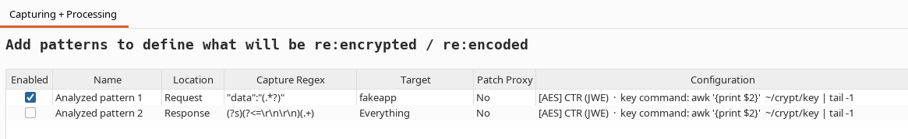
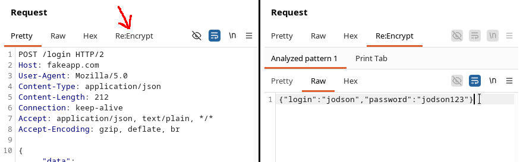
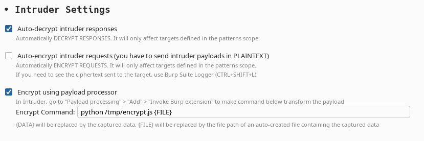
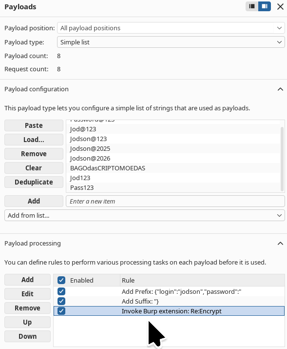
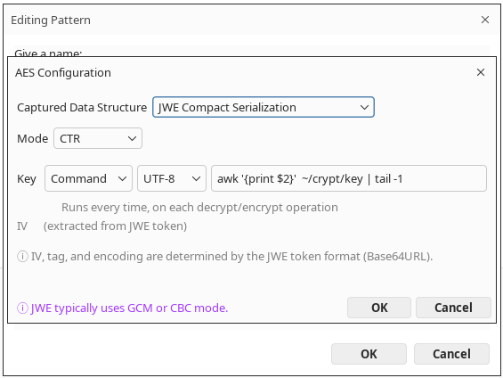
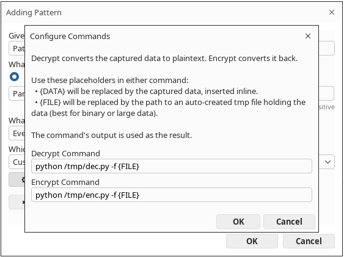
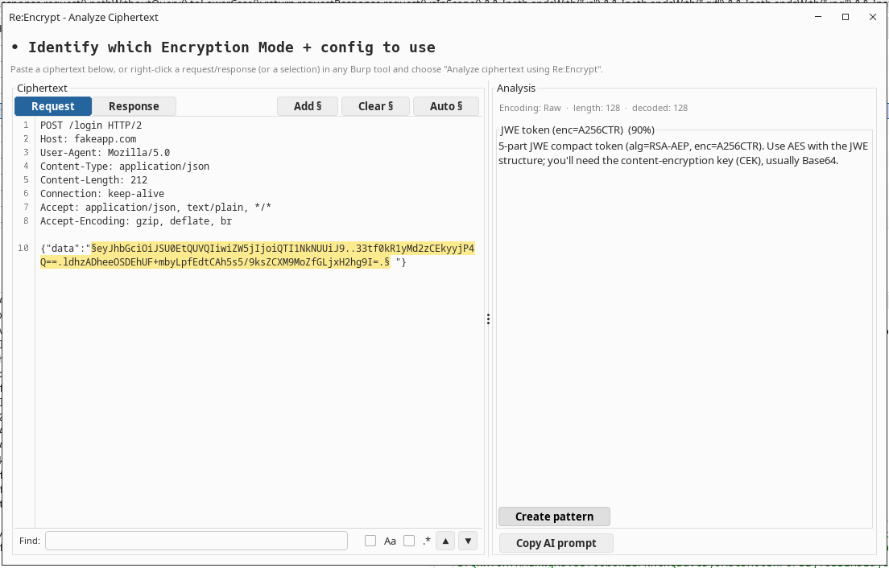
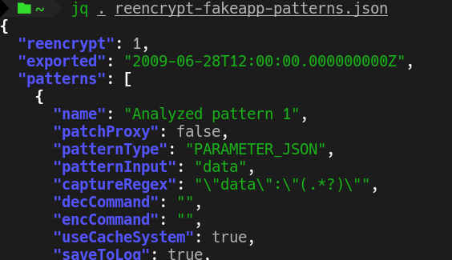
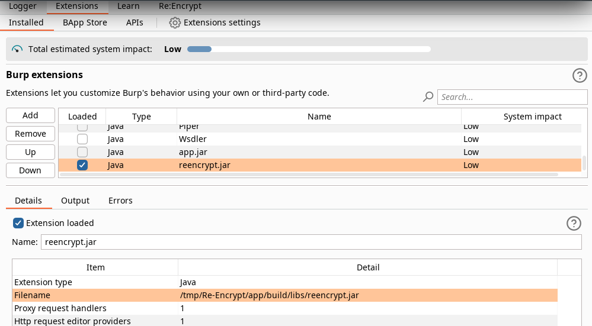

# Re:Encrypt

**Re:Encrypt** is a Burp Suite extension for apps that encrypt their own traffic.

Tell it *where* the encrypted data is and *how* to decrypt it. From then on, Burp shows you plaintext, and whatever you change is encrypted back.



## ✨ What it does

### 👁️ Plaintext everywhere

A **Re:Encrypt** tab shows up next to *Pretty* / *Raw*. Open it and you read the request as the app wrote it, not as it was sent.



### ✏️ Edit without the terminal

In Repeater, type your payload into the Re:Encrypt custom tab, press **Send**, and it goes out encrypted. No copying blobs in and out of a shell.

### ⚡ Intruder

Encrypted endpoints can be fuzzed like any other. In **Intruder Settings**, enable *Auto-encrypt intruder requests* and write your payloads in plaintext, or *Encrypt using payload processor* and add it as a rule under Intruder → Payloads → Payload processing.





### 🔐 Built-in AES and RSA

For common schemes, you don't need any script: pick **AES** or **RSA** and fill in the fields.



### 🌍 …or any encryption at all

Anything the built-ins don't cover, a script does. Give a **decrypt** and an **encrypt** command in any language. 
The captured data arrives as `{DATA}` (inline) or `{FILE}` (an auto-created temporary file):



### 🧪 Not sure what the encryption is?

Right-click a request → **Extensions → Re:Encrypt → Analyze ciphertext**. 
Re:Encrypt marks what looks encrypted, guesses the scheme, and **Create pattern** turns a guess into a working pattern.
There is also **Copy AI prompt** if you'd rather ask an LLM.



### 🔁 Patch proxy

**Patch proxy** decrypts and re-encrypts traffic as it flows, with no tab to open.

The classic use: the app encrypts with a public key it got from the server, so in theory you cannot read anything. Swap in *your* public key on the client, then let Re:Encrypt decrypt with your private key and re-encrypt with the original one before the request continues to the server.

To confirm what was changed, use the dropdown next to *Original request* in Proxy:


### 📤 Share a setup

Export your patterns to a JSON file and import them anywhere. Useful for sending a working config to a teammate.



### 🤖 Keep patterns in sync with a file

Point **Auto-load** at a JSON file and Re:Encrypt keeps itself up to date with it, every few seconds.
Useful when a script, or an AI agent, is working out the encryption while you test.

⚠️ A pattern can run shell commands, so only import or auto-load files you trust.

### 📝 Log

Every decryption can be written to a log file, so you can grep the whole session in plaintext.

## 🚀 Quick start

1. Open the **Re:Encrypt** tab → **Capturing + Processing** → **Add**.
2. Name it, and choose whether it applies to **requests** or **responses**.
3. Say where the ciphertext is: a header, a URL/JSON parameter, the whole body, or your own regex.
4. Choose a cryptographic algorithm and fill in the fields, or write your **decrypt** and **encrypt** commands.
5. After adding the patterns, go to your requests and watch the magic happen.

## 📦 Install

Requirements: **Burp Suite v2025.x or later**, **Java 21+**.

1. Clone this repository.
2. Build the jar:
```bash
./gradlew build
```
3. In Burp: **Extensions → Installed → Add**, then pick `app/build/libs/re-encrypt.jar`.



## 🐛 Troubleshooting

* **Re:Encrypt custom tab is not appearing**: Check the pattern's *Target*, and if the pattern is enabled.
* **Nothing is decrypted**: Look for execution errors. Check if the **Configuration** column of that pattern shows a ⚠ saying something is missing.
* **Command errors**: Logs will appear in one of these depending on the tool and the error: at the top of the Re:Encrypt tab, in Burp's Event log, or in Burp's **Extensions → Output / Errors**.
* **Odd trailing characters**: One trailing newline is stripped from command output, everything else is kept as-is.

## 🙌 Acknowledgements

This extension originated from an idea by `Jodson`. Development was made possible by `Marcelo`,
`Palula` & [Tempest](https://tempest.com.br), with additional technical assistance from the
`PortSwigger support team`.

---

## 📝 TODO
- ~~highlighting inside Print Tab~~
- ~~checkbox to decide when enable Print Tab highlight~~
- ~~why caret is not working? + check focus (find a Java function to focus on the editor again)~~
- ~~save all the decrypted data to a file log~~
- ~~?save commands again (consider change to xxh algorithm)?~~
- ~~remove old save commands code + showMessage~~
- ~~monitoring cache size~~
- ~~again bug on editor focus~~
- ~~intruder support again (use the HttpHandler to decrypt the message, edit comments through the HttpHandler, intruder tab)~~
- ~~?pre-defined patterns?~~
- ~~better UI (layout, buttons) - WIP~~
    * how intuitive is the UI now?
    * sizes of the panels
- ~~pre defined encryption/scripts~~
- ~~update README~~
- ~~export/import configs~~
- how can MCP work with this extension?
- improve Crypto Analysis tool
    - prompt
    - detections
    - skill integration
- teach SKILL to configure Re:Encrypt
- websockets support (repeater, automatically patch proxy messages)
- test intercept req and res
- test on windows
- submit extension to BApp Store

---

**Let's Re:Encrypt!**
