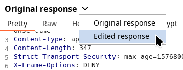

# Re:Encrypt

**Re:Encrypt** is a Burp Suite extension designed to handle custom encryption and decryption of traffic on the fly. It allows you to define patterns (regex) for encrypted data and command-line tools to transform it, seamlessly integrating with Proxy, Repeater, and Intruder tools.

## ✨ Key Features

* **👁️ See the Plaintext**: Easily decrypts traffic in Proxy, Intruder and Repeater so you can understand the application flow.
* **✏️ Edit without Pain**: Modify decrypted data directly in Burp Suite without copying and pasting from a terminal. 
* **⚡ Intruder Support**: Attack encrypted endpoints effortlessly. 
* **🌍 Universal Compatibility**: Works with any encryption scheme. Just provide a command-line script (Python, Node, OpenSSL, etc.) to decrypt and encrypt your data.

## 📦 Installation

### Requirements
* Burp Suite v2024.x or later (Recommended v2025.9+).
* Java 21 or later.

### Build from Source
1. Clone the repository.
2. Run the build command:
```bash
./gradlew build
```
3. Load the generated JAR (`app/build/libs/re-encrypt.jar`) in Burp Suite via **Extensions > Installed > Add**.

## ⚙️ Configuration

Configure your rules in the **Re-Encrypt** tab.

### 1. Define Patterns
Add regex patterns to capture the data you want to transform.
* **Request Patterns**: Target encrypted data in requests (e.g., `data=(.*?)&`).
* **Response Patterns**: Target encrypted data in responses.
* **Context Menu**: Right-click the patterns table to manage patterns.

### 2. Configure Commands
Define the shell commands to execute for each pattern.
* **Decrypt Command**: Decrypts the captured ciphertext to plaintext.
* **Encrypt Command**: Encrypts plaintext back to ciphertext.

**Command Placeholders:**
* `{DATA}`: Replaced by the captured string (e.g., `echo "{DATA}" | base64 -d`).
* `{FILE}`: Replaced by the path to a temporary file containing the captured data (recommended for complex payloads).

**Example Command (Python)**:
```bash
python /path/to/script.py --decrypt --file {FILE}
```

## 🚀 Usage

### Repeater
* When a pattern is matched, Re:Encrypt adds a custom tab to Burp Suite.
* If you open the custom tab, the extension uses the **Decrypt Command** to recover the plaintext, and shows it in the tab. 
* You can then edit the plaintext directly.
* When you click in Send, the extension will:
    1. Encrypts your plaintext using the **Encrypt Command** while updating the request body.
    2. Send the encrypted request.

### Proxy
* Apart from the custom tab to decrypt data in Proxy, Re:Encrypt also offers a **"Patch proxy"** option to re-encrypt (decrypt + encrypt) traffic on the fly.
* One of the main use cases for using "Patch proxy" is when the client-side is encrypting using a public key received from the server, so theoretically there is no way to decrypt. However, you still can create your own pair of keys and set a new public key in the client-side. Then, use this option to decrypt requests using your private key, and encrypt them again before sending to the server using the original public key
* To verify modifications, click on the dropdown arrow next to "Original request", or check the Re:Encrypt's log file




### Intruder

#### Method A: Auto-Encrypt
1. Enable **"Auto-encrypt intruder requests"** in Re:Encrypt settings.
2. Configure your attack using **plaintext** payloads.
3. *Result:* The extension encrypts matched parts considering all the patterns and commands defined in "Capturing + Processing".

#### Method B: Payload Processor
1. Enable **"Encrypt using payload processor"** in Re:Encrypt settings.
2. In Intruder > Payloads > Payload Processing, add an "Invoke Burp extension" rule -> Select Re:Encrypt's option.
3. *Result:* Payloads are encrypted individually before being sent.


## 🐛 Troubleshooting

* **Logs**: Check Burp Suite Event log for command outputs and errors.
* **Payload Trimming**: The extension strips a single trailing newline from command output (to handle `echo`-like behavior) but preserves other whitespace.

## 🙌 Acknowledgements

This extension originated from an idea by `Jodson`. Development was made possible by `Marcelo`, `Palula` & [Tempest](https://tempest.com.br), with additional technical assistance from the `PortSwigger support team`.

---

## 📝 TODO
- ~~highlighting inside Print Tab~~
- ~~checkbox to decide when enable Print Tab highlight~~
- ~~why caret is not working? + check focus (find a Java function to focus on the editor again)~~
- ~~save all the decrypted data to a file log~~
- ~~?save commands again (consider change to xxh algorithm)?~~
- ~~remove old save commands code + showMessage~~
- ~~monitoring cache size~~
- ~~again bug on editor focus~~
- ~~intruder support again (use the HttpHandler to decrypt the message, edit comments through the HttpHandler, intruder tab)~~
- ~~?pre-defined patterns?~~
- better UI (layout, buttons) - WIP
    * how intuitive is the UI now?
    * sizes of the panels
    * https://portswigger.net/bappstore
- pre defined encryption/scripts
- websockets support (repeater, automatically patch proxy messages)
- export/import configs
- update README - WIP
- test intercept req and res
- test on windows
- submit extension to BApp Store

--- 

**Let's Re:Encrpy!**

