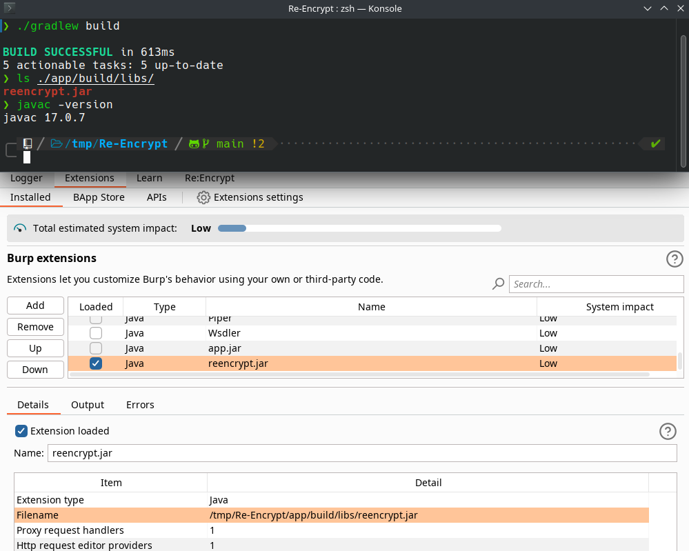

# Re:Encrypt

This burp extension allows you to patch parts of requests via command-line tools. Use cases include:

* Easily view and modify encrypted data through Editor Tab.
* Create match-replace rules that affect encrypted data through Patch Proxy + sed-like tools.
* Create complex match-replace rules, using data from files or other requests.
* Trigger commands when a specific pattern is detected.
* Easily encrypt multiple intruder payloads.

Let's re:encode!

Burp Suite v2025.8 or later and Java version 21 or later are recommended.


## Installing Re:Encrypt

- <strike>(soon) You can install through the BApp Store</strike>

- You can build this project with the command below, then load the jar (./app/build/libs/reencrypt.jar) in Burp Suite via Extensions > Installed:

```bash
./gradlew build
```

- **Alternatively**, you can download the jar from https://github.com/morkin1792/Re-Encrypt/releases



## How to use

### 1) Go to Re:Encrypt tab


### 2) Set request and/or response patterns that will define what should be patched.
Examples:
- capturing bodies with at least one character:
```re
\r\n\r\n(.+)
```

- capturing a json parameter called data:
```re
data":"(.*?)"
```


### 3) Define the commands to decode/decrypt and encode/encrypt the patterns captured before. 

- You can use `{arg}` to define what part should be replaced by the captured text: 


- You can use `{file}` to refer to a path of a temporary file containing the captured text:


### 4) Optionally, patch the proxy requests.
- If you are working with an app that uses an assymetric cryptography, maybe you want to mark the checkbox below, this way it is possible to automatically re:encrypt proxy requests:


You can find a script that helps make MiTM in RSA [here](TODO).

## Functionalities

### Proxy


### Repeater


### Intruder


### Save commands


## TODO
- ~~highlighting inside Print Tab~~
- ~~checkbox to decide when enable Print Tab highlight~~
- ~~why caret is not working? + check focus (find a Java function to focus on the editor again)~~
- intruder support again (use the HttpHandler to decrypt the message, edit comments through the HttpHandler)
- save all the decrypted data to a file log
- ?save commands again (consider change to xxh algorithm)?
- remove old save commands code + showMessage
- ?pre-defined patterns?
- better UI (layout, buttons)
- ?pre defined encryption/scripts?
- test intercept req and res
- websockets support (repeater, automatically patch proxy messages)
- submit extension to BApp Store

## Credits

- Thanks to `Jodson` for giving birth to this extension.
